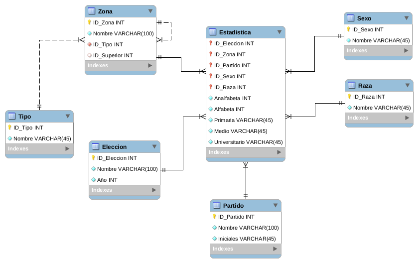

# **INSTITUTO CENTROAMERICANO ELECTORAL**

PR2 SISTEMAS DE BASES DE DATOS 1

HORACIO CIRAIZ ORELLANA

BASE DE DATOS CON MYSQL

# **bd1-proyecto2-201513758**
El Instituto Centroamericano Electoral es una institución dedicada a registrar, controlar y evaluar estadísticas de los comicios electorales en los diferentes países de Centro América, para lo cual requiere un sistema de bases de datos donde se puedan hacer consultas de diferentes temas electorales

## **Descripicion**
***

El Instituto Centroamericano Electoral (ICE) contrata sus servicios profesionales
para realizar reingeniería al proceso de almacenamiento debido a que actualmente
hay demasiada inconsistencia que puede provocarles serios problemas legales. El
Instituto realiza el esfuerzo de exportar toda la información actual a un archivo Excel
que usted tendrá a disposición para realizar el análisis correspondiente, deberá
aplicar las formas de normalización que considere adecuada con el objetivo de
eliminar la redundancia y crear una nueva plataforma escalable.

## **Tabla Base de Datos**
***

| NOMBRE_ELECCION | AÑO_ELECCION | PAIS | REGION | DEPTO |MUNICIPIO |PARTIDO |NOMBRE_PARTIDO | SEXO  | RAZA | ANALFABETOS | ALFABETOS| SEXO | RAZA | PRIMARIA | NIVEL MEDIO | UNIVERSITARIOS |
|:--------------:|:-------------:|:--------------:|:-------------:|:-------------:|:-------------:|:-------------:|:-------------:|:-------------:|:-------------:|:-------------:|:-------------:|:-------------:|:-------------:|:-------------:|:-------------:|:-------------:|
|Elecciones Municipales | 2005 |El Salvador | REGION 1|CABAÑAS|SESUNTEPEQUE | ARENA | ALIANZA NAC. REP | HOMBRES|INDIGENAS|2298 |4800 |HOMBRES|INDIGENAS|1471 | 450 |2879|
|Elecciones Municipales | 2005 |El Salvador | REGION 1|CABAÑAS|ILLOBASCO | ARENA | ALIANZA NAC. REP | HOMBRES|INDIGENAS|2448 |5536 |HOMBRES|INDIGENAS|1807 | 2966 |763|
|Elecciones Municipales | 2005 |El Salvador | REGION 1|CABAÑAS|VICTORIA | ARENA | ALIANZA NAC. REP | HOMBRES|INDIGENAS|1724 |3638 |HOMBRES|INDIGENAS|1421 | 1183 |1034|
|Elecciones Municipales | 2005 |El Salvador | REGION 1|CABAÑAS|SAN ISIDRO | ARENA | ALIANZA NAC. REP | HOMBRES|INDIGENAS|583 | 2772 |HOMBRES|INDIGENAS|1747 | 895 |130|
|Elecciones Municipales | 2005 |El Salvador | REGION 1|CABAÑAS|JUTIAPA | ARENA | ALIANZA NAC. REP | HOMBRES|INDIGENAS|31 |2772 |HOMBRES|INDIGENAS|1747 | 895 |130|
|... | ... |... | ... |...|... | ... | ... | ...|...|... |... |...|...|... | ... |...|

## **PRIMERA FORMA NORMAL**
***

- Elimine los grupos repetidos de las tablas individuales.

- Cree una tabla independiente para cada conjunto de datos relacionados.

- Identifique cada conjunto de datos relacionados con una clave principal.

### **TABLAS PRIMERA FORMA NORMAL**
***
### Tablas agregadas:

### **Tabla  Eleccion**

| ID_Eleccion | Eleccion | Año | 
|:--------------:|:-------------:|:--------------:|
|1|Elecciones Municipales|2005|
|2|Elecciones Municipales|2004|

### **Tabla  Zona**

| ID_Zona | Nombre | Tipo | ID_Superior
|:--------------:|:-------------:|:--------------:|:--------------:|
|1|EL SALVADOR|PAIS|NULL|
|2|GUATEMALA|PAIS|NULL|
|3|COSTA RICA|PAIS|NULL|
|4|PANAMA|PAIS|NULL|
|5|REGION 1|PAIS|4|
|6|VICTORIA|PAIS|5|
|...|...|...|...|

### **Tabla  Partido**
| ID_Partido | Partido | Nombre |
|:--------------:|:-------------:|:--------------:|
|1|ARENA|ALIANZA NAC. REP 
|2|URN|UNION REPULICANA|
|3|CGN|CENTRO GABRINETE NACIONAL|
|4|FARS|FUERTE ANT.REG. SOCIAL |
|...|...|...|

### **Tabla  Sexo**
| ID_Sexo | Nombre |
|:--------------:|:-------------:|
|1|HOMBRES|
|2|MUJERES|

## **SEGUNDA FORMA NORMAL**
***

- Cree tablas independientes para conjuntos de valores que se apliquen a varios registros.

- Relacione estas tablas con una clave externa.

### Tablas Agregadas:

### **Tabla  Tipo**
| ID_Tipo | Nombre |
|:--------------:|:-------------:|
|1|PAIS|
|2|REGION|
|3|DEPARTAMENTO|
|4|MUNICIPIO|

## **TERCERA FORMA NORMAL**
***

- Elimine los campos que no dependan de la clave.

### **Tabla Resultado**

| NOMBRE_ELECCION | ZONA |PARTIDO |NOMBRE_PARTIDO| SEXO|RAZA|ANALFABETOS | ALFABETOS PRIMARIA | NIVEL MEDIO | UNIVERSITARIOS |
|:--------------:|:-------------:|:--------------:|:-------------:|:-------------:|:-------------:|:-------------:|:-------------:|:-------------:|:-------------:|
|1|1|1|1|1|2298 |4800 |1471 | 450 |2879|
|1|1|1|1|2|2448 |5536 |1807 | 2966 |763|
|1|1|1|1|3| 1724 |3638 |1421 | 1183 |1034|
|1|1|1|1|4|583 | 2772 |1747 | 895 |130|
|1|1|1|1|5| 31 |2772 |1747 | 895 |130|
|... | ...|...|...|...|...|...|...|...|...|

## **MODELO ENTIDAD RELACION**
***

